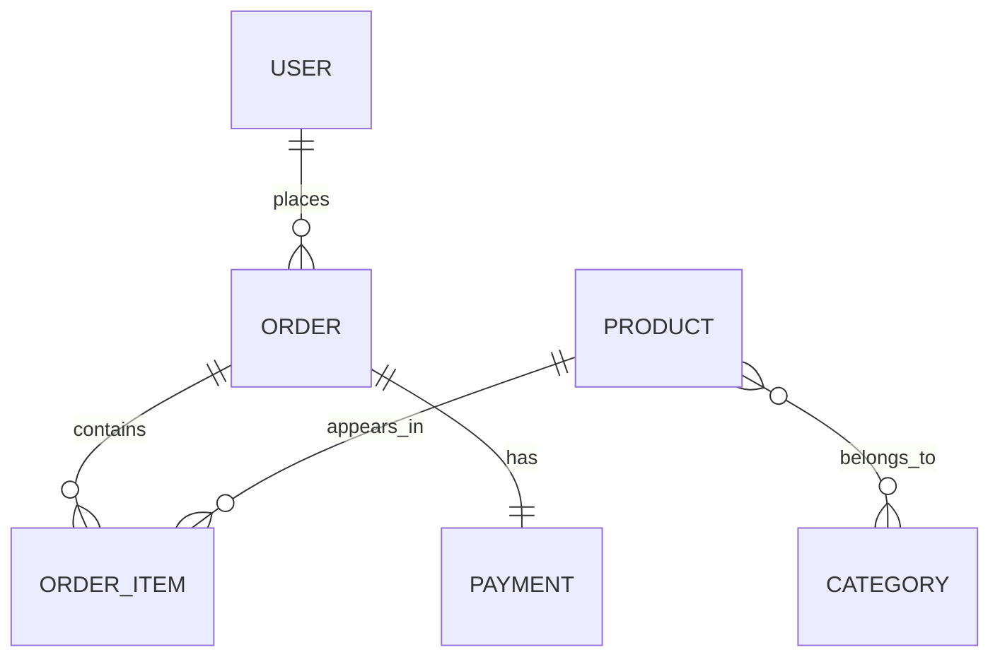

# API

API RESTful desenvolvida em **Java com Spring Boot** para simular a base de um sistema de pedidos/e-commerce. O projeto implementa recursos para usuários, produtos, categorias, pedidos, itens de pedido e pagamento, utilizando uma arquitetura em camadas, persistência com JPA/Hibernate e banco de dados H2 em memória para ambiente de teste.

Este projeto foi construído com foco em praticar os principais fundamentos de uma aplicação backend moderna: criação de endpoints REST, mapeamento objeto-relacional, relacionamento entre entidades, camada de serviço, repositórios, tratamento de exceções e uso correto de respostas HTTP.

---

## Tecnologias utilizadas

* **Java 21**
* **Spring Boot 4.0.6**
* **Spring Web MVC**
* **Spring Data JPA**
* **Hibernate / Jakarta Persistence**
* **H2 Database**
* **PostgreSQL Driver**
* **Maven / Maven Wrapper**
* **Jackson** para serialização JSON

---

## Funcionalidades implementadas

* Listagem de usuários, produtos, categorias e pedidos.
* Busca de recursos por ID.
* Cadastro de novos usuários com retorno HTTP `201 Created` e header `Location`.
* Atualização de usuários existentes.
* Exclusão de usuários com retorno HTTP `204 No Content`.
* Modelagem de domínio com relacionamentos entre entidades.
* Banco H2 em memória para testes e desenvolvimento local.
* Carga automática de dados iniciais no perfil `test`.
* Tratamento centralizado de exceções para recursos não encontrados e erros de banco de dados.
* Uso de status HTTP adequados para cada operação da API.

---

## Modelo de domínio

O projeto representa um pequeno domínio de pedidos, semelhante à estrutura inicial de um e-commerce.



### Principais entidades

| Entidade      | Responsabilidade                                                    |
| ------------- | ------------------------------------------------------------------- |
| `User`        | Representa os usuários/clientes do sistema.                         |
| `Order`       | Representa os pedidos feitos por usuários.                          |
| `OrderItem`   | Representa os itens de um pedido, com quantidade, preço e subtotal. |
| `Product`     | Representa os produtos disponíveis.                                 |
| `Category`    | Representa as categorias dos produtos.                              |
| `Payment`     | Representa o pagamento associado a um pedido.                       |
| `OrderStatus` | Enum responsável por controlar o status do pedido.                  |

---

## Arquitetura do projeto

O projeto segue uma organização em camadas, separando responsabilidades e facilitando manutenção, leitura e evolução da aplicação.

```text
src/main/java/com/rafaelrocha/course
├── config
│   └── TestConfig.java
├── entities
│   ├── Category.java
│   ├── Order.java
│   ├── OrderItem.java
│   ├── OrderStatus.java
│   ├── Payment.java
│   ├── Product.java
│   ├── User.java
│   └── pk
│       └── OrderItemPK.java
├── repositories
│   ├── CategoryRepository.java
│   ├── OrderItemRepository.java
│   ├── OrderRepository.java
│   ├── ProductRepository.java
│   └── UserRepository.java
├── resources
│   ├── CategoryResource.java
│   ├── OrderResource.java
│   ├── ProductResource.java
│   ├── UserResource.java
│   └── exceptions
│       ├── ResourceExceptionHandler.java
│       └── StandardError.java
├── service
│   ├── CategoryService.java
│   ├── OrderService.java
│   ├── ProductService.java
│   ├── UserService.java
│   └── exceptions
│       ├── DatabaseException.java
│       └── ResourceNotFoundException.java
└── CourseApplication.java
```

---

## Endpoints disponíveis

### Usuários

| Método   | Endpoint      | Descrição                        |
| -------- | ------------- | -------------------------------- |
| `GET`    | `/users`      | Lista todos os usuários.         |
| `GET`    | `/users/{id}` | Busca um usuário pelo ID.        |
| `POST`   | `/users`      | Cadastra um novo usuário.        |
| `PUT`    | `/users/{id}` | Atualiza os dados de um usuário. |
| `DELETE` | `/users/{id}` | Remove um usuário.               |

### Produtos

| Método | Endpoint         | Descrição                 |
| ------ | ---------------- | ------------------------- |
| `GET`  | `/products`      | Lista todos os produtos.  |
| `GET`  | `/products/{id}` | Busca um produto pelo ID. |

### Categorias

| Método | Endpoint           | Descrição                    |
| ------ | ------------------ | ---------------------------- |
| `GET`  | `/categories`      | Lista todas as categorias.   |
| `GET`  | `/categories/{id}` | Busca uma categoria pelo ID. |

### Pedidos

| Método | Endpoint       | Descrição                |
| ------ | -------------- | ------------------------ |
| `GET`  | `/orders`      | Lista todos os pedidos.  |
| `GET`  | `/orders/{id}` | Busca um pedido pelo ID. |

---

## Como executar o projeto

### Pré-requisitos

Antes de iniciar, é necessário ter instalado:

* Java 21
* Git

O projeto já possui Maven Wrapper, então não é obrigatório ter o Maven instalado globalmente.

### Clonando o repositório

```bash
git clone https://github.com/rafaelrch/springboot-jpa
cd course
```

### Executando no Linux ou macOS

```bash
./mvnw spring-boot:run
```

### Executando no Windows

```bash
mvnw.cmd spring-boot:run
```

A aplicação será iniciada em:

```text
http://localhost:8080
```

---

## Banco de dados H2

O projeto está configurado para usar o perfil `test`, com banco H2 em memória.

Acesse o console do H2 em:

```text
http://localhost:8080/h2-console
```

Configurações de acesso:

```text
JDBC URL: jdbc:h2:mem:testdb
User: sa
Password:
```

O arquivo `TestConfig.java` executa automaticamente uma carga inicial de dados ao iniciar a aplicação no perfil de teste.

---

## Conceitos praticados

Durante o desenvolvimento deste projeto, foram aplicados conceitos importantes de backend com Java e Spring Boot, como:

* Criação de API REST.
* Uso de controllers com `@RestController` e `@RequestMapping`.
* Injeção de dependência com `@Autowired`.
* Persistência de dados com Spring Data JPA.
* Mapeamento de entidades com `@Entity`, `@Table`, `@Id` e `@GeneratedValue`.
* Relacionamentos com `@OneToMany`, `@ManyToOne`, `@ManyToMany`, `@OneToOne` e `@EmbeddedId`.
* Serialização JSON com Jackson.
* Tratamento de exceções com `@ControllerAdvice` e `@ExceptionHandler`.
* Uso de `ResponseEntity` para controlar corpo, status e headers das respostas HTTP.
* Criação de URI para recursos recém-criados com `ServletUriComponentsBuilder`.

---

## Possíveis melhorias futuras

* Implementar DTOs para separar entidades internas das respostas da API.
* Adicionar validações com Bean Validation.
* Criar documentação interativa com Swagger/OpenAPI.
* Implementar autenticação e autorização com Spring Security.
* Criar ambiente de produção usando PostgreSQL.
* Adicionar testes unitários e testes de integração.
* Padronizar tratamento de exceções em todos os recursos da aplicação.
* Ocultar ou criptografar o campo de senha nas respostas da API.

---

## Autor

Desenvolvido por **Rafael Rocha** como projeto de estudo em Java, Spring Boot e desenvolvimento de APIs RESTful.
